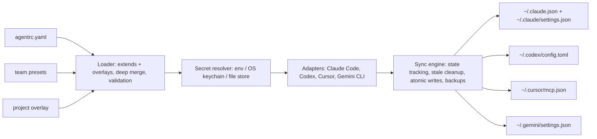

# agentrc

[English](README.md) | [中文](README.zh.md) | [日本語](README.ja.md)

[](LICENSE) [](package.json)

**AI コーディングツールのためのオープンソース・local-first な dotfiles マネージャー。1 つのマニフェストを 4 つのクライアントへ同期し、シークレットを平文で書きません。**


```bash
# agentrc はまだ npm に公開されていません — ソースからインストールします:
git clone https://github.com/JaydenCJ/agentrc.git
cd agentrc && npm ci && npm run build && npm link
```

## なぜ agentrc なのか

Claude Code は `~/.claude.json` と `~/.claude/settings.json`、Codex は `~/.codex/config.toml`、Cursor は `~/.cursor/mcp.json`、Gemini CLI は `~/.gemini/settings.json` を要求します。4 つのファイル、3 種類の文法、しかもマシンごとに必要です。MCP サーバーを 1 つ追加するには同じ編集をすべての場所で繰り返し、トークンのローテーションでは各ファイルに散らばった平文の認証情報を探し回ることになります。MCP プロジェクト自身のロードマップは、クロスクライアントな設定ポータビリティをコミュニティに委ねられたギャップとして挙げています。agentrc は、dotfiles リポジトリに置ける 1 枚の宣言的マニフェストでこのギャップを埋めます。

|  | agentrc | chezmoi | 手作業での編集 |
|---|---|---|---|
| MCP / skills / hooks の意味を理解 | yes (4 clients) | no (copies files verbatim) | no |
| 同期ファイル内のシークレット | `${secret:NAME}` references | DIY templating | plaintext |
| プロジェクト単位のオーバーレイ | yes (`.agentrc.yaml`) | no | per-client, by hand |
| チームプリセット | yes (`extends:`) | possible with manual wiring | copy-paste |
| 自分が書いた分だけ削除 | yes (state file) | owns whole files | no tracking |

chezmoi は dotfiles マネージャーというカテゴリを確立しましたが、管理するのは*ファイル*であって*意味*ではありません。`~/.codex/config.toml` のサーバーエントリと `~/.cursor/mcp.json` のエントリが同じものだとは知り得ません。agentrc は両者を同じものとして扱い、一致し続けるように保ちます。

## 特徴

- **1 つのマニフェストで 4 クライアント** — Claude Code (JSON)、Codex (TOML)、Cursor (JSON)、Gemini CLI (JSON) のフォーマット変換器を内蔵し、Gemini の `httpUrl` と `url` の使い分けや Codex の `mcp_servers` テーブルといった各クライアントの癖にも対応します。
- **壊れた設定を書かない** — ケイパビリティマトリクスが各クライアントの対応状況を把握します。Codex での hooks や stdio 専用クライアントでの http サーバーは、明確な警告とスキップになり、壊れたファイルは書き出されません。
- **シークレットは参照のまま** — マニフェストには `${secret:NAME}` と書くだけです。同期時に env、OS キーチェーン（macOS `security`、Linux `secret-tool`）、chmod 600 のファイルストアの順で解決し、環境変数が保存済みの値を隠している場合は通知します。
- **外科手術のような、巻き戻せる書き込み** — 既存設定にマージし、自分が書いたエントリを状態ファイルで追跡して、掃除もその範囲だけに限定します。上書き前に `.agentrc.bak` を残し、書き込みはアトミックです。手作業で追加したエントリは無事に残ります。
- **プロジェクト単位のオーバーレイ** — リポジトリに `.agentrc.yaml` を置けば、プロジェクト固有のサーバー追加や継承エントリの無効化（`docs: null`）ができます。`agentrc sync --project .` がプロジェクトスコープの設定を書き出します。
- **チームプリセット** — `extends: [./presets/team-base.yaml]` でチーム共通設定を個人設定の下層に敷けます。
- **書き直しではなくインポート** — `agentrc import <client>` が既存のクライアント設定をマニフェスト YAML に逆変換し、埋め込まれた認証情報をシークレットストアへ抽出できます。

## クイックスタート

インストール:

```bash
# agentrc はまだ npm に公開されていません — ソースからインストールします:
git clone https://github.com/JaydenCJ/agentrc.git
cd agentrc && npm ci && npm run build && npm link
```

一度だけ宣言し、シークレットを保存し、すべてへ同期します:

```bash
mkdir -p ~/.agentrc && cat > ~/.agentrc/agentrc.yaml <<'YAML'
version: 1
mcpServers:
  github:
    command: npx
    args: ["-y", "@modelcontextprotocol/server-github"]
    env:
      GITHUB_PERSONAL_ACCESS_TOKEN: "${secret:GH_MCP_TOKEN}"
YAML

agentrc secret set GH_MCP_TOKEN ghp_yourtoken
agentrc sync
agentrc status --check >/dev/null && echo in-sync
```

出力:

```text
stored secret "GH_MCP_TOKEN" in file store
(plain-file store at <home>/.agentrc/secrets.json, chmod 600; an OS keychain is preferred when available)
scope: user
manifest: ~/.agentrc/agentrc.yaml

claude-code
  + ~/.claude.json  (+ mcpServers.github)
  . ~/.claude/settings.json  (nothing to write)

codex
  + ~/.codex/config.toml  (+ mcp_servers.github)

cursor
  + ~/.cursor/mcp.json  (+ mcpServers.github)

gemini-cli
  + ~/.gemini/settings.json  (+ mcpServers.github)

done: 4 created, 0 updated, 1 unchanged, 1 secret(s) resolved
in-sync
```

macOS ではシークレットはファイルストアではなくキーチェーンに保存されます。`agentrc init` はコメント付きのスターターマニフェストを生成します。`agentrc init --from claude-code --save-secrets` なら設定済みのクライアントから移行でき、認証情報のシークレットストアへの抽出まで行います。適用前の変更内容は `agentrc diff` で unified diff として確認できます。diff 内では解決済みのシークレット値が `${secret:NAME}` 参照の形にマスクされるため、プレビューに認証情報の平文が出力されることはありません。

## マニフェストリファレンス

```yaml
version: 1                       # required
extends: [./presets/base.yaml]   # optional preset layers, deep-merged underneath
clients: [claude-code, codex, cursor, gemini-cli]   # default: all four

mcpServers:
  name:
    transport: stdio | http | sse   # inferred from command/url when omitted
    command: npx                    # stdio servers
    args: ["..."]
    env: { KEY: "${secret:NAME}" }
    url: https://...                # http/sse servers
    headers: { Authorization: "Bearer ${secret:NAME}" }
    clients: [claude-code]          # optional per-entry restriction
  unwanted: null                    # in overlays: remove an inherited entry

skills:
  code-review: { path: ./skills/code-review }   # relative to the declaring file

hooks:
  preToolUse:                      # events follow Claude Code's hook schema
    - { matcher: Bash, command: ./hooks/guard.sh, timeout: 10 }

permissions:
  allow: ["Bash(npm run test:*)"]
  deny: ["Read(./.env)"]
```

補足:

- 管理対象ファイルは正規化されたフォーマットで書き直されます。`~/.codex/config.toml` の更新が必要な場合、ファイル内のコメントは保持されません（`.agentrc.bak` バックアップは残ります）。
- 解決済みのシークレット値は、最終的にローカルのクライアント設定ファイルに書き込まれます。クライアントはそこから読むためです。ポイントは*共有可能なマニフェスト*に認証情報が残らないことです。`${NAME}` 形式の環境変数参照を書き出したい場合は `--refs` を渡してください。
- 相対パスの skill と `./` 形式の hook コマンドは、宣言したファイルを基準に解決されるため、チームリポジトリに置いたプリセットもそのまま機能します。

## アーキテクチャ



何がどこに同期されるか:

| 機能 | Claude Code | Codex | Cursor | Gemini CLI |
|---|---|---|---|---|
| MCP servers (stdio) | `~/.claude.json` | `~/.codex/config.toml` | `~/.cursor/mcp.json` | `~/.gemini/settings.json` |
| MCP servers (http/sse) | yes | warn + skip | yes | yes (`httpUrl`/`url`) |
| Hooks | `~/.claude/settings.json` | warn + skip | warn + skip | warn + skip |
| 権限ルール | `~/.claude/settings.json` | warn + skip | warn + skip | warn + skip |
| Skills | `~/.claude/skills/` | warn + skip | warn + skip | warn + skip |
| プロジェクトスコープ | `.mcp.json`, `.claude/` | warn + skip | `.cursor/mcp.json` | `.gemini/settings.json` |

## ロードマップ

- [x] 4 クライアント同期: MCP サーバー、skills、hooks、権限、シークレット、オーバーレイ、プリセット、インポート（v0.1.0）
- [ ] クライアント追加: Windsurf、Zed、OpenCode、VS Code（Copilot MCP）
- [ ] 暗号化ファイルストア（age）: OS キーチェーンのないマシン向け
- [ ] マシンプロファイル: ホスト別オーバーレイ
- [ ] `agentrc sync --from-git <url>`: チームのマニフェストリポジトリを直接適用
- [ ] Homebrew formula とビルド済みバイナリ

全体は [open issues](https://github.com/JaydenCJ/agentrc/issues) を参照してください。

## コントリビューション

コントリビューションを歓迎します。まずは [good first issue](https://github.com/JaydenCJ/agentrc/issues?q=is%3Aissue+is%3Aopen+label%3A%22good+first+issue%22) から、または [Discussions](https://github.com/JaydenCJ/agentrc/discussions) でお気軽にどうぞ。開発環境と基本ルールは [CONTRIBUTING.md](CONTRIBUTING.md) にあります。最も価値ある貢献は新しいクライアントアダプターの追加です。ソースからのビルドは `npm install && npm run build && npm test` で行えます。

## ライセンス

[MIT](LICENSE)
