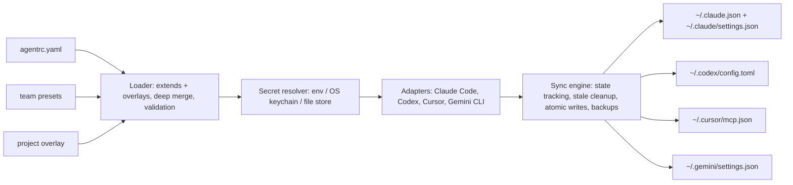

# agentrc

[English](README.md) | [中文](README.zh.md) | [日本語](README.ja.md)

[](LICENSE) [](package.json)

**Open-source, local-first dotfiles manager for AI coding tools — one manifest, four clients, no plaintext secrets.**


```bash
# agentrc is not yet on npm — install from source:
git clone https://github.com/JaydenCJ/agentrc.git
cd agentrc && npm ci && npm run build && npm link
```

## Why agentrc?

Claude Code wants `~/.claude.json` plus `~/.claude/settings.json`, Codex wants `~/.codex/config.toml`, Cursor wants `~/.cursor/mcp.json`, and Gemini CLI wants `~/.gemini/settings.json` — four files, three syntaxes, on every machine. Adding one MCP server means repeating the same edit everywhere, and rotating a token means hunting plaintext credentials across all of those files. The MCP project's own roadmap lists cross-client configuration portability as a gap left to the community; agentrc fills it with one declarative manifest that lives in your dotfiles repo.

|  | agentrc | chezmoi | manual editing |
|---|---|---|---|
| Understands MCP / skills / hooks semantics | yes (4 clients) | no (copies files verbatim) | no |
| Secrets in synced files | `${secret:NAME}` references | DIY templating | plaintext |
| Per-project overlay | yes (`.agentrc.yaml`) | no | per-client, by hand |
| Team presets | yes (`extends:`) | possible with manual wiring | copy-paste |
| Removes only what it wrote | yes (state file) | owns whole files | no tracking |

chezmoi proved the dotfiles-manager category, but it manages *files*, not *meaning*: it cannot know that a server entry in `~/.codex/config.toml` and one in `~/.cursor/mcp.json` are the same thing. agentrc does, and keeps them in agreement.

## Features

- **One manifest, four clients** — format converters for Claude Code (JSON), Codex (TOML), Cursor (JSON) and Gemini CLI (JSON), including per-client quirks such as Gemini's `httpUrl` vs `url` and Codex's `mcp_servers` tables.
- **No broken configs** — a capability matrix knows what each client supports; hooks on Codex or http servers on stdio-only clients produce a clear warning and a skip, never garbage output.
- **Secrets stay references** — write `${secret:NAME}` in the manifest; values resolve at sync time from env, the OS keychain (macOS `security`, Linux `secret-tool`) or a chmod-600 file store, with a notice when an env var shadows a stored value.
- **Surgical, reversible writes** — merges into existing configs, tracks its own entries in a state file, cleans up only those, leaves `.agentrc.bak` backups and writes atomically; hand-added entries survive.
- **Per-project overlays** — a `.agentrc.yaml` in a repo adds project servers or disables inherited ones (`docs: null`); `agentrc sync --project .` writes the project-scope configs.
- **Team presets** — `extends: [./presets/team-base.yaml]` layers shared configuration underneath personal settings.
- **Import, not rewrite** — `agentrc import <client>` converts an existing client config back into manifest YAML and can extract embedded credentials into the secret store.

## Quickstart

Install:

```bash
# agentrc is not yet on npm — install from source:
git clone https://github.com/JaydenCJ/agentrc.git
cd agentrc && npm ci && npm run build && npm link
```

Declare once, store the credential, sync everywhere:

```bash
mkdir -p ~/.agentrc && cat > ~/.agentrc/agentrc.yaml <<'YAML'
version: 1
mcpServers:
  github:
    command: npx
    args: ["-y", "@modelcontextprotocol/server-github"]
    env:
      GITHUB_PERSONAL_ACCESS_TOKEN: "${secret:GH_MCP_TOKEN}"
YAML

agentrc secret set GH_MCP_TOKEN ghp_yourtoken
agentrc sync
agentrc status --check >/dev/null && echo in-sync
```

Output:

```text
stored secret "GH_MCP_TOKEN" in file store
(plain-file store at <home>/.agentrc/secrets.json, chmod 600; an OS keychain is preferred when available)
scope: user
manifest: ~/.agentrc/agentrc.yaml

claude-code
  + ~/.claude.json  (+ mcpServers.github)
  . ~/.claude/settings.json  (nothing to write)

codex
  + ~/.codex/config.toml  (+ mcp_servers.github)

cursor
  + ~/.cursor/mcp.json  (+ mcpServers.github)

gemini-cli
  + ~/.gemini/settings.json  (+ mcpServers.github)

done: 4 created, 0 updated, 1 unchanged, 1 secret(s) resolved
in-sync
```

On macOS the secret goes to the keychain instead of the file store. `agentrc init` scaffolds a commented starter manifest; `agentrc init --from claude-code --save-secrets` seeds it from the client you already configured, extracting credentials into the secret store. `agentrc diff` previews any pending change as a unified diff before you apply it; resolved secret values are redacted back to their `${secret:NAME}` references in the diff, so previews never print credentials.

## Manifest reference

```yaml
version: 1                       # required
extends: [./presets/base.yaml]   # optional preset layers, deep-merged underneath
clients: [claude-code, codex, cursor, gemini-cli]   # default: all four

mcpServers:
  name:
    transport: stdio | http | sse   # inferred from command/url when omitted
    command: npx                    # stdio servers
    args: ["..."]
    env: { KEY: "${secret:NAME}" }
    url: https://...                # http/sse servers
    headers: { Authorization: "Bearer ${secret:NAME}" }
    clients: [claude-code]          # optional per-entry restriction
  unwanted: null                    # in overlays: remove an inherited entry

skills:
  code-review: { path: ./skills/code-review }   # relative to the declaring file

hooks:
  preToolUse:                      # events follow Claude Code's hook schema
    - { matcher: Bash, command: ./hooks/guard.sh, timeout: 10 }

permissions:
  allow: ["Bash(npm run test:*)"]
  deny: ["Read(./.env)"]
```

Worth knowing:

- Managed files are rewritten with normalized formatting; comments in `~/.codex/config.toml` are not preserved when an update is needed (a `.agentrc.bak` backup is kept).
- Resolved secret values do end up in the local client config files — that is where clients read them. The point is that the *shareable manifest* stays credential-free; pass `--refs` to write `${NAME}` env-style references instead.
- Relative skill paths and `./`-style hook commands resolve against the file that declares them, so presets shipped in a team repo keep working.

## Architecture



What syncs where:

| Feature | Claude Code | Codex | Cursor | Gemini CLI |
|---|---|---|---|---|
| MCP servers (stdio) | `~/.claude.json` | `~/.codex/config.toml` | `~/.cursor/mcp.json` | `~/.gemini/settings.json` |
| MCP servers (http/sse) | yes | warn + skip | yes | yes (`httpUrl`/`url`) |
| Hooks | `~/.claude/settings.json` | warn + skip | warn + skip | warn + skip |
| Permission rules | `~/.claude/settings.json` | warn + skip | warn + skip | warn + skip |
| Skills | `~/.claude/skills/` | warn + skip | warn + skip | warn + skip |
| Project scope | `.mcp.json`, `.claude/` | warn + skip | `.cursor/mcp.json` | `.gemini/settings.json` |

## Roadmap

- [x] Four-client sync: MCP servers, skills, hooks, permissions, secrets, overlays, presets, import (v0.1.0)
- [ ] More clients: Windsurf, Zed, OpenCode, VS Code (Copilot MCP)
- [ ] Encrypted file store (age) for machines without an OS keychain
- [ ] Machine profiles: per-host overlays
- [ ] `agentrc sync --from-git <url>` to apply a team manifest repo directly
- [ ] Homebrew formula and prebuilt binaries

See the [open issues](https://github.com/JaydenCJ/agentrc/issues) for the full list.

## Contributing

Contributions are welcome — start with a [good first issue](https://github.com/JaydenCJ/agentrc/issues?q=is%3Aissue+is%3Aopen+label%3A%22good+first+issue%22) or open a [discussion](https://github.com/JaydenCJ/agentrc/discussions). Development setup and ground rules are in [CONTRIBUTING.md](CONTRIBUTING.md); the most valuable contribution is a new client adapter. Working from source: `npm install && npm run build && npm test`.

## License

[MIT](LICENSE)
