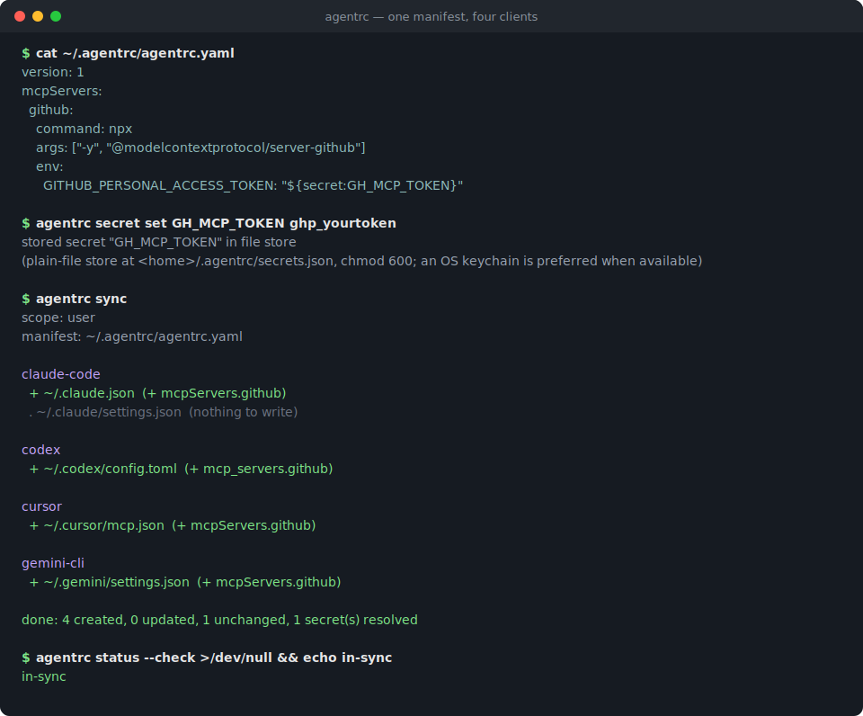
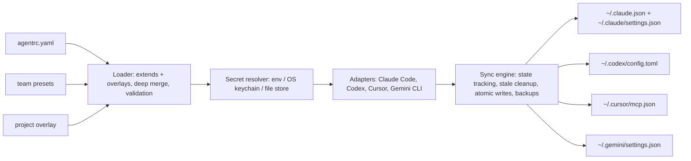

# agentrc

[English](README.md) | [中文](README.zh.md) | [日本語](README.ja.md)

[](LICENSE) [](package.json)

**AI 编码工具的开源 local-first dotfiles 管理器——一份清单同步四个客户端，密钥永不明文。**



```bash
# agentrc 尚未发布到 npm——从源码安装：
git clone https://github.com/JaydenCJ/agentrc.git
cd agentrc && npm ci && npm run build && npm link
```

## 为什么是 agentrc？

Claude Code 要 `~/.claude.json` 加 `~/.claude/settings.json`，Codex 要 `~/.codex/config.toml`，Cursor 要 `~/.cursor/mcp.json`，Gemini CLI 要 `~/.gemini/settings.json`——四个文件、三种语法，每台机器都要来一遍。加一个 MCP 服务器意味着在所有地方重复同一处修改；轮换一个 token 意味着到这些文件里逐个翻找明文凭据。MCP 项目自己的路线图把跨客户端配置可移植性列为留给社区的缺口；agentrc 用一份可以放进 dotfiles 仓库的声明式清单把它补上。

|  | agentrc | chezmoi | 手工编辑 |
|---|---|---|---|
| 理解 MCP / skills / hooks 语义 | yes (4 clients) | no (copies files verbatim) | no |
| 同步文件中的密钥 | `${secret:NAME}` references | DIY templating | plaintext |
| per-project overlay | yes (`.agentrc.yaml`) | no | per-client, by hand |
| 团队 preset | yes (`extends:`) | possible with manual wiring | copy-paste |
| 只清理自己写入的条目 | yes (state file) | owns whole files | no tracking |

chezmoi 证明了 dotfiles 管理器这个品类，但它管理的是*文件*而非*语义*：它无法知道 `~/.codex/config.toml` 里的一个服务器条目和 `~/.cursor/mcp.json` 里的那个是同一个东西。agentrc 知道，并让两者保持一致。

## 特性

- **一份清单，四个客户端**——内置 Claude Code（JSON）、Codex（TOML）、Cursor（JSON）、Gemini CLI（JSON）的格式转换器，并处理各家怪癖，如 Gemini 的 `httpUrl` 与 `url` 之分、Codex 的 `mcp_servers` 表。
- **不产出坏配置**——能力矩阵记录每个客户端支持什么；Codex 上的 hooks、仅支持 stdio 的客户端遇到 http 服务器时，得到的是清晰的警告加跳过，而不是写坏的文件。
- **密钥只存引用**——清单里写 `${secret:NAME}`；同步时按 env、系统 keychain（macOS `security`、Linux `secret-tool`）、chmod-600 文件存储的顺序解析；当环境变量遮蔽了已存储的值时会给出提示。
- **外科手术式、可回退的写入**——合并进已有配置，用状态文件跟踪自己写过的条目，清理时也只动这些条目；覆盖前留 `.agentrc.bak` 备份，写入是原子的；手工添加的条目安然无恙。
- **per-project overlay**——在仓库里放一个 `.agentrc.yaml` 即可添加项目专属服务器或禁用继承条目（`docs: null`）；`agentrc sync --project .` 写出项目级配置。
- **团队 preset**——`extends: [./presets/team-base.yaml]` 把团队共享配置垫在个人设置之下。
- **导入而非重写**——`agentrc import <client>` 把现有客户端配置反向转换成清单 YAML，还能把内嵌的凭据抽取进密钥存储。

## 快速开始

安装：

```bash
# agentrc 尚未发布到 npm——从源码安装：
git clone https://github.com/JaydenCJ/agentrc.git
cd agentrc && npm ci && npm run build && npm link
```

声明一次、存一次密钥、同步到所有客户端：

```bash
mkdir -p ~/.agentrc && cat > ~/.agentrc/agentrc.yaml <<'YAML'
version: 1
mcpServers:
  github:
    command: npx
    args: ["-y", "@modelcontextprotocol/server-github"]
    env:
      GITHUB_PERSONAL_ACCESS_TOKEN: "${secret:GH_MCP_TOKEN}"
YAML

agentrc secret set GH_MCP_TOKEN ghp_yourtoken
agentrc sync
agentrc status --check >/dev/null && echo in-sync
```

输出：

```text
stored secret "GH_MCP_TOKEN" in file store
(plain-file store at <home>/.agentrc/secrets.json, chmod 600; an OS keychain is preferred when available)
scope: user
manifest: ~/.agentrc/agentrc.yaml

claude-code
  + ~/.claude.json  (+ mcpServers.github)
  . ~/.claude/settings.json  (nothing to write)

codex
  + ~/.codex/config.toml  (+ mcp_servers.github)

cursor
  + ~/.cursor/mcp.json  (+ mcpServers.github)

gemini-cli
  + ~/.gemini/settings.json  (+ mcpServers.github)

done: 4 created, 0 updated, 1 unchanged, 1 secret(s) resolved
in-sync
```

在 macOS 上，密钥会进入系统 keychain 而非文件存储。`agentrc init` 会生成一份带注释的起步清单；`agentrc init --from claude-code --save-secrets` 则从你已配置好的客户端导入，并把凭据抽取进密钥存储。应用变更前可用 `agentrc diff` 以统一 diff 预览将要发生的修改；diff 中已解析的密钥值会被还原成 `${secret:NAME}` 引用形式脱敏，预览绝不打印凭据明文。

## 清单参考

```yaml
version: 1                       # required
extends: [./presets/base.yaml]   # optional preset layers, deep-merged underneath
clients: [claude-code, codex, cursor, gemini-cli]   # default: all four

mcpServers:
  name:
    transport: stdio | http | sse   # inferred from command/url when omitted
    command: npx                    # stdio servers
    args: ["..."]
    env: { KEY: "${secret:NAME}" }
    url: https://...                # http/sse servers
    headers: { Authorization: "Bearer ${secret:NAME}" }
    clients: [claude-code]          # optional per-entry restriction
  unwanted: null                    # in overlays: remove an inherited entry

skills:
  code-review: { path: ./skills/code-review }   # relative to the declaring file

hooks:
  preToolUse:                      # events follow Claude Code's hook schema
    - { matcher: Bash, command: ./hooks/guard.sh, timeout: 10 }

permissions:
  allow: ["Bash(npm run test:*)"]
  deny: ["Read(./.env)"]
```

值得了解：

- 托管文件会以规范化格式重写；当 `~/.codex/config.toml` 需要更新时，其中的注释不会保留（会留下 `.agentrc.bak` 备份）。
- 解析后的密钥值最终会写入本机客户端配置文件——客户端就是从那里读取的。重点是*可分享的清单*保持无凭据；想改写为 `${NAME}` 环境变量式引用，传 `--refs`。
- 相对的 skill 路径与 `./` 形式的 hook 命令都相对于声明它们的文件解析，因此放在团队仓库里的 preset 依然可用。

## 架构



什么同步到哪里：

| 特性 | Claude Code | Codex | Cursor | Gemini CLI |
|---|---|---|---|---|
| MCP servers (stdio) | `~/.claude.json` | `~/.codex/config.toml` | `~/.cursor/mcp.json` | `~/.gemini/settings.json` |
| MCP servers (http/sse) | yes | warn + skip | yes | yes (`httpUrl`/`url`) |
| Hooks | `~/.claude/settings.json` | warn + skip | warn + skip | warn + skip |
| 权限规则 | `~/.claude/settings.json` | warn + skip | warn + skip | warn + skip |
| Skills | `~/.claude/skills/` | warn + skip | warn + skip | warn + skip |
| 项目作用域 | `.mcp.json`, `.claude/` | warn + skip | `.cursor/mcp.json` | `.gemini/settings.json` |

## 路线图

- [x] 四客户端同步：MCP 服务器、skills、hooks、权限、密钥、overlay、preset、导入（v0.1.0）
- [ ] 更多客户端：Windsurf、Zed、OpenCode、VS Code（Copilot MCP）
- [ ] 加密文件存储（age），服务没有系统 keychain 的机器
- [ ] 机器 profile：按主机的 overlay
- [ ] `agentrc sync --from-git <url>`，直接应用团队清单仓库
- [ ] Homebrew formula 与预编译二进制

完整列表见 [open issues](https://github.com/JaydenCJ/agentrc/issues)。

## 参与贡献

欢迎贡献——从 [good first issue](https://github.com/JaydenCJ/agentrc/issues?q=is%3Aissue+is%3Aopen+label%3A%22good+first+issue%22) 入手，或到 [Discussions](https://github.com/JaydenCJ/agentrc/discussions) 发起讨论。开发环境与基本规则见 [CONTRIBUTING.md](CONTRIBUTING.md)；最有价值的贡献是新增一个客户端适配器。从源码构建：`npm install && npm run build && npm test`。

## 许可证

[MIT](LICENSE)
